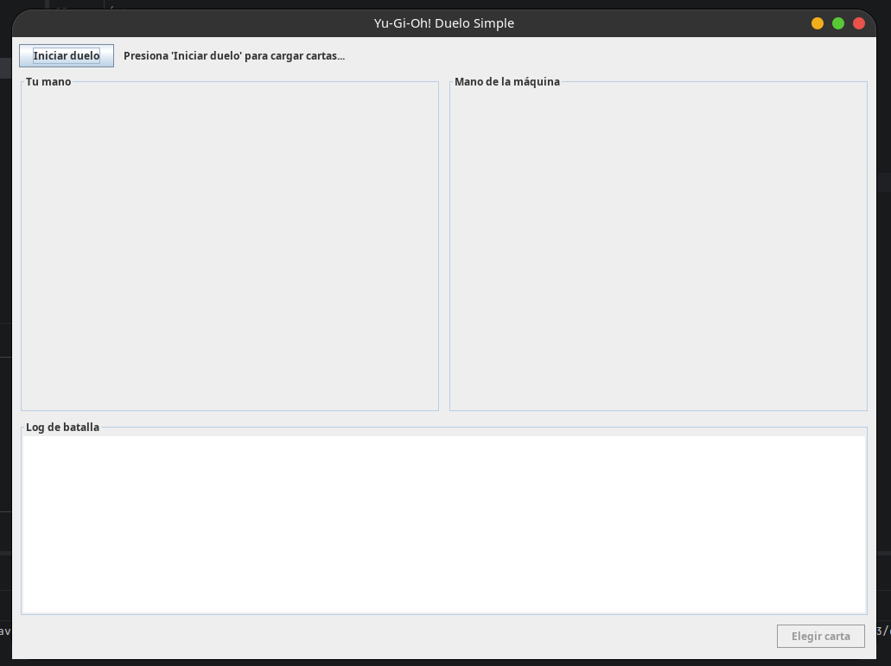
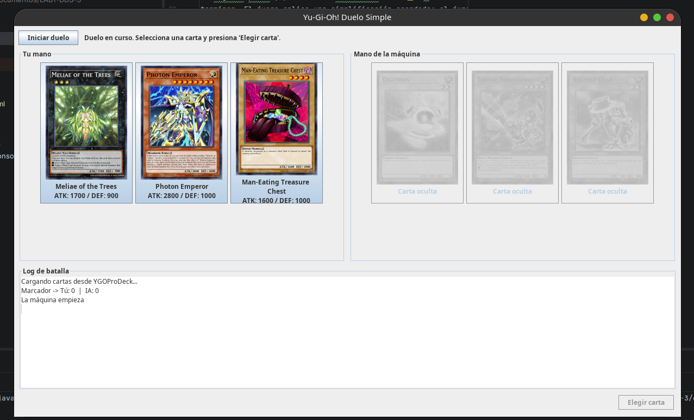
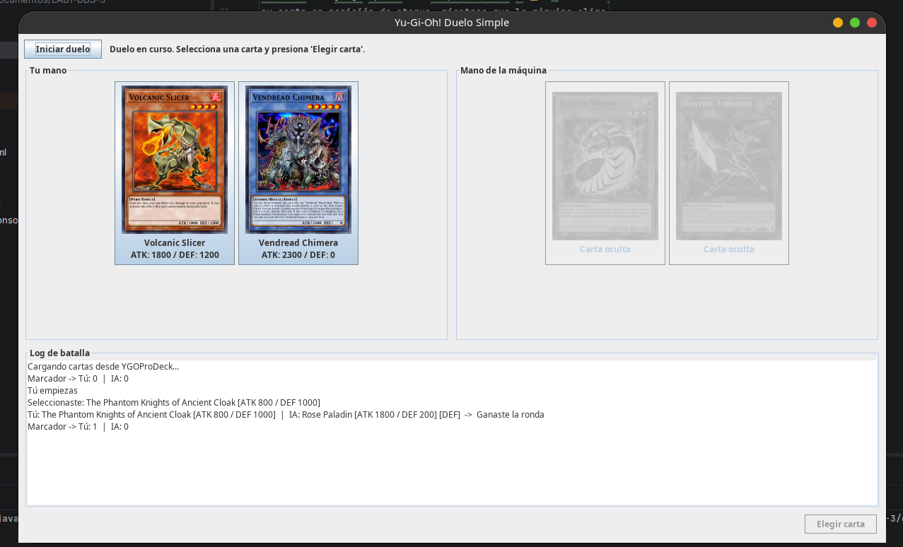
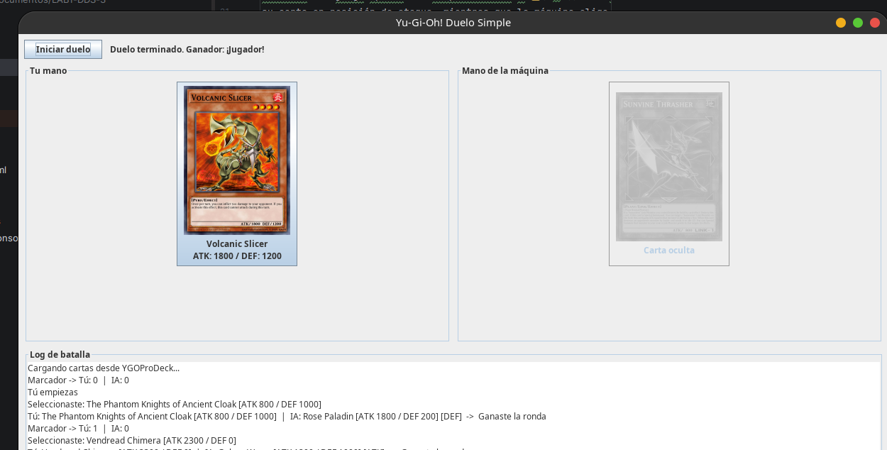
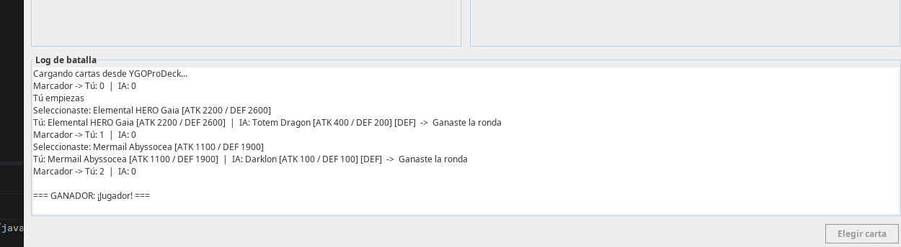
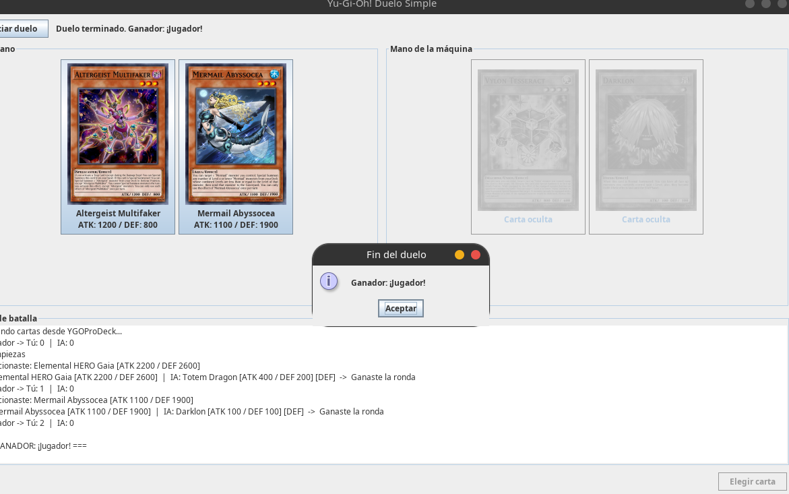

# Información académica

- **Estudiante:** Felipe Ortiz Calan
- **Código:** 2380642
- **Universidad:** Universidad del Valle
- **Materia:** Desarrollo de Software 3

## Inicializar el proyecto

### Requisitos

- Java 11 o superior.
- IntelliJ IDEA u otro IDE compatible con proyectos Java.
- Conexión a internet para consultar la API de YGOProDeck y descargar las
  imágenes de las cartas.

### Ejecución desde IntelliJ IDEA

1. Abrir la carpeta del proyecto en IntelliJ IDEA.
2. Verificar que el SDK configurado sea Java 11 o superior.
3. Confirmar que la librería `lib/json-20230227.jar` esté incluida en el
   classpath del proyecto.
4. Abrir `src/Main.java`.
5. Ejecutar el método `main`.

### Ejecución desde la terminal

Desde la carpeta raíz del proyecto, compilar las clases con:

```bash
javac -cp lib/json-20230227.jar -d out src/*.java
```

Después, iniciar la aplicación con:

```bash
java -cp "out:lib/json-20230227.jar" Main
```

En Windows, reemplazar `:` por `;` en el classpath.

## Diseño
El proyecto está organizado en paquetes que separan claramente las responsabilidades:
`model` contiene la clase `Card`, un POJO que representa una carta Monster con su
nombre, ATK, DEF y la imagen ya descargada; `api` aloja `YugiApiClient`, encargado
de consumir la API pública de YGOProDeck mediante `java.net.http.HttpClient`,
filtrando las respuestas hasta obtener únicamente cartas de tipo Monster y
descargando su imagen con `ImageIO`. La lógica del duelo vive en `logic/Duel`,
que no conoce nada de Swing: solo administra mazos, marcador y reglas de
comparación, y comunica los cambios a través de la interface `BattleListener`
(`onTurn`, `onScoreChanged`, `onDuelEnded`), lo que desacopla por completo la
lógica de la interfaz gráfica.

La capa de presentación está en `ui/MainFrame`, un `JFrame` que implementa
`BattleListener` y reacciona a cada evento escribiendo en el log de batalla y
actualizando el marcador visual. Los botones "Iniciar duelo" y "Elegir carta"
utilizan `ActionListener` para disparar la carga de cartas y la resolución de
turnos respectivamente. Para cumplir con la restricción de no bloquear el hilo
de la UI, las peticiones de red se ejecutan dentro de un `SwingWorker` que corre
en segundo plano y publica los resultados en el *Event Dispatch Thread* al
terminar. El juego aplica una simplificación acordada: el jugador siempre juega
su carta en posición de ataque, mientras que la máquina elige carta y posición
(ATK o DEF) al azar; los empates no otorgan puntos y las cartas vuelven a la
mano. Gana el primero en alcanzar 2 rondas.

## Capturas de pantalla

### 1. Pantalla inicial
Aquí se muestra la ventana recién abierta, con el botón **Iniciar duelo**
disponible y el log de batalla vacío a la espera de la primera partida.



### 2. Carga de cartas desde la API
Al presionar **Iniciar duelo**, la aplicación consulta varias veces el endpoint
`randomcard.php` y descarga las imágenes en segundo plano sin congelar la
interfaz.



### 3. Duelo en curso
Las tres cartas del jugador se muestran a la izquierda con su imagen, nombre,
ATK y DEF. La mano de la máquina permanece oculta hasta que se resuelve cada
turno.



### 4. Log de batalla con resultado del turno
Cada turno agrega una línea al log indicando qué carta jugó cada bando, el
resultado y el marcador acumulado. Los empates también se registran.



### 5. Anuncio del ganador
Cuando un jugador alcanza 2 rondas ganadas, aparece un `JOptionPane` con el
nombre del ganador y el log se cierra con la línea `=== GANADOR: ... ===`.

